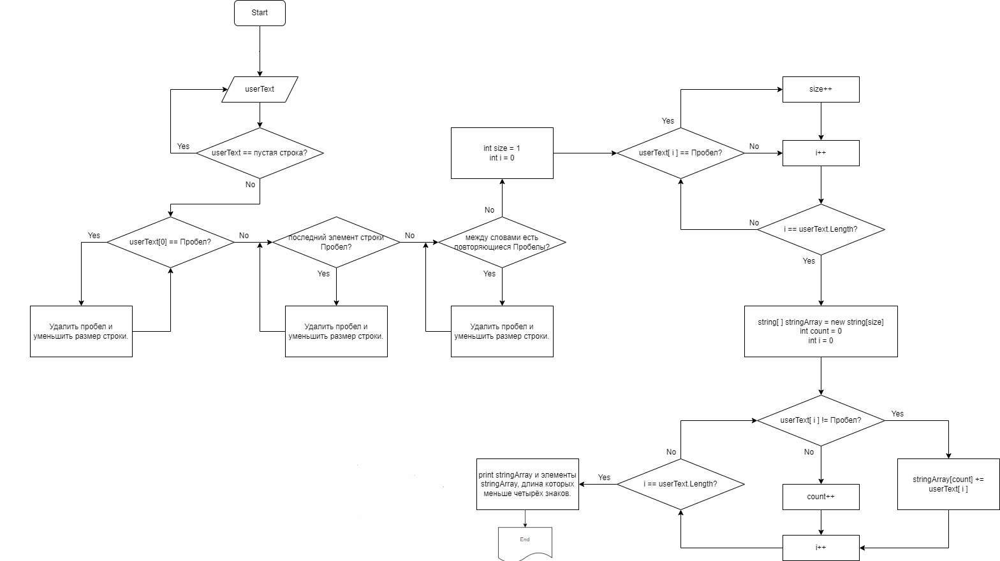

# Итоговая проверочная работа

Данная работа необходима для проверки знаний и навыков по итогу прохождения первого блока обучения на программе разработчик, чтобы убедиться что базовое знакомство с it прошло успешно.

## Шаги выполнения  

1. Создать репозиторий на GitHub
2. Нарисовать блок-схему алгоритма (можно обойтись блок-схемой основной содержательной части, если вы выделяете её в отдельный метод)
3. Снабдить репозиторий оформленным текстовым описанием решения (файл README.md)
4. Написать программу, решающую поставленную задачу
5. Использовать контроль версий в работе над этим небольшим проектом (не должно быть так, что всё залито одним коммитом, как минимум этапы 2, 3, и 4 должны быть расположены в разных коммитах)

## Задача 

Написать программу, которая из имеющегося массива строк формирует новый массив из строк, длина которых меньше, либо равна 3 символам. Первоначальный массив можно ввести с клавиатуры, либо задать на старте выполнения алгоритма. При решении не рекомендуется пользоваться коллекциями, лучше обойтись исключительно массивами.

## Примеры:

[“Hello”, “2”, “world”, “:-)”] → [“2”, “:-)”]

[“1234”, “1567”, “-2”, “computer science”] → [“-2”]

[“Russia”, “Denmark”, “Kazan”] → []

# Решение

## Действия

* Запросить ввод текста от пользователя.
* Перевести введённый текст в массив.
* 1 элемент = 1 слово.
* Слова отсекаются наличием пробела.
* Вывести массив на экран.
* Вывести на экран элементы массива, подходящие по условиям задачи.

## Схема решения задачи

## Описание программы

1. Программа запрашивает ввод текста от пользователя.
Если пользователь ошибся или ввёл пустую строку, состоящую из пробелов, то программа выдаёт сообщение: "Строка не должна быть пустой!"
2. После такого сообщения программа просит пользователя заново ввести текст.
3. Если введённая строка не пустая, то программа начнёт проверять её на наличие лишних пробелов (т.к. в будущем они будут использоваться как определитель разделения слов).
4. Лишние пробелы в начале, в конце и между словами будут удаляться из текста.
5. Для создания массива программа узнаёт какого размера он будет.
6. Т.к. строка не пустая - размер будущего массива по умолчанию будет равен 1.
7. Каждый пробел будет добавлять +1 к размеру.
8. Программа создаёт массив нужного размера и записывает в него значения.
9. Пробел является определителем окончания записи 
значений в элемент массива и перехода к записи следующего элемента.
10. После окончания записи значений в массив программа выводит массив на экран.
11. Также программа выводит, подходящие под условие задачи, элементы массива.
